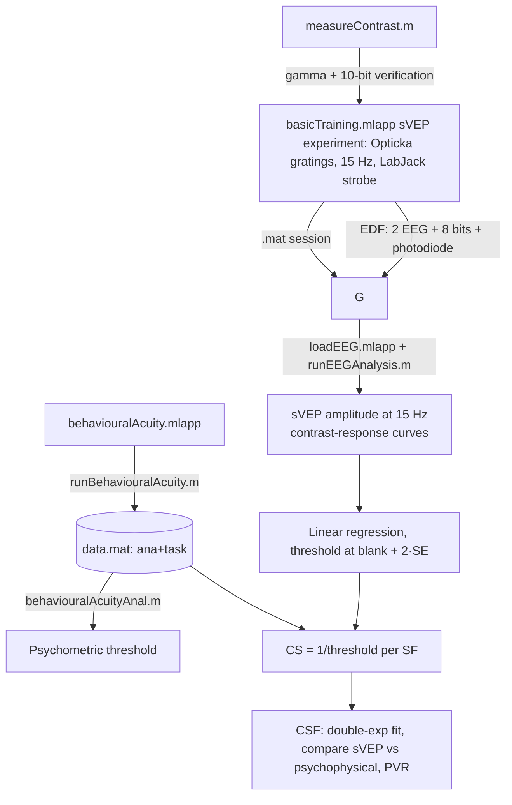
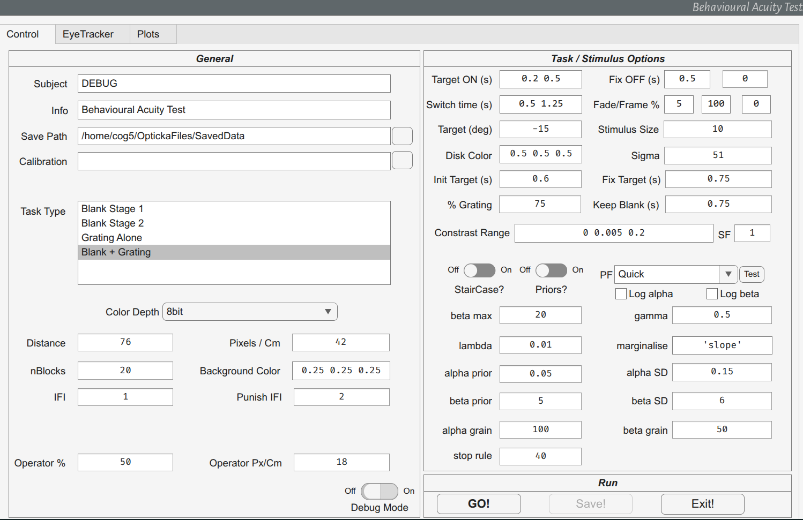
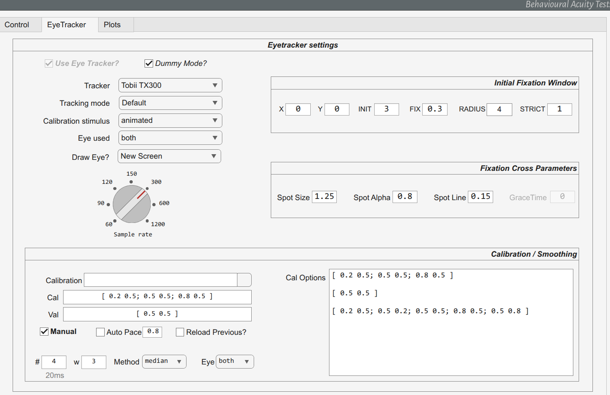
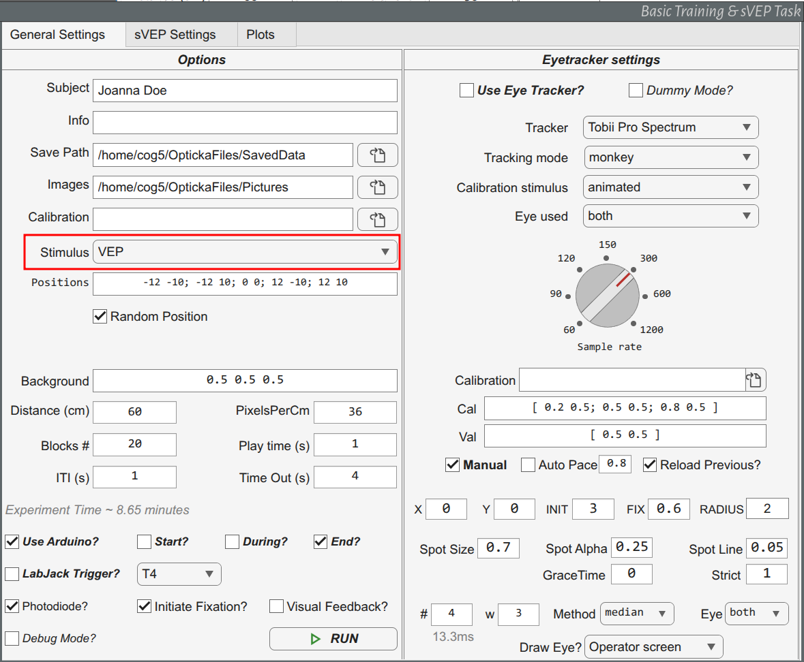

# sVEPTesting

Steady-state Visual Evoked Potential (sVEP) and psychophysical contrast-sensitivity testing for **alert infant macaques**, combining real-time eye tracking with a non-invasive 3D-printed head restraint.

This repository contains the MATLAB code and GUIs used for the experiments described in:

> **"Non-invasive Measurements of Visual Sensitivity using Eye Tracking and Visual Evoked Potentials in Young Alert Macaques"**
> Shu Wang, Yuanyang Huang, Jiahao Tu, Xiaochun Wang, Rui Liu, Shahab Zarei, Hong Liu, Ian M. Andolina.

The code implements the two measurement arms of the study:

1. **sVEP contrast-sensitivity (CS) measurement** — objective, electrophysiological estimation of contrast thresholds from steady-state VEPs recorded while the monkey passively fixates gratings flickering at 15 Hz, with gaze-triggered trial selection and rigorous trial screening using the eye tracker.
2. **Psychophysical contrast-sensitivity measurement** — an eye-movement-based behavioural choice task (saccade to a peripheral target = "I saw the grating", maintain fixation = blank), which provides the reference behaviour for validating the sVEP estimates (Fig. 1D in the manuscript).

Both pipelines share the same stimulus family (vertically oriented sine-wave gratings, 0.5–8 cycles/deg, 0.5–96% contrast), the same eye tracker (Tobii, via Titta), and the same reward system (Arduino-controlled juice delivery via the Opticka `arduinoManager`).

---

## Citation

If you use this code in your research, please cite the manuscript (once published) and the software on which it depends:

- Andolina, I. M. (2023). **Opticka: Psychophysics-toolbox based experiment manager** (v2.16.1). Zenodo. https://doi.org/10.5281/zenodo.13756387
- Kleiner, M., et al. (2007). *What's New in Psychtoolbox-3*. Perception 36:1–16.
- Niehorster, D. C., Andersson, R., & Nyström, M. (2020). **Titta: A toolbox for creating PsychToolbox and Psychopy experiments with Tobii eye trackers**. Behavior Research Methods 52:1970–1979.
- Niehorster, D. C., et al. (2024). *Enhancing eye tracking for nonhuman primates… adaptive calibration*. Behavior Research Methods 57:4.
- Oostenveld, R., et al. (2011). **FieldTrip: Open source software for advanced analysis of MEG, EEG and invasive electrophysiological data**. Computational Intelligence and Neuroscience 2011:156869.

Data supporting the manuscript are publicly available at: https://doi.org/10.6084/m9.figshare.31802695

---

## Repository contents

| File | Purpose | Corresponding manuscript part |
|------|---------|-------------------------------|
| `Helmet/` | THe Helmet STL model files for 3D printing a non-invasive head restraint. | Fig. 1 |
| `basicTraining.mlapp` | GUI to train subjects to fixation and run the fixation-only sVEP test measuring contrast-sensitivity function. | "Fixation-only Contrast Threshold Measurement" |
| `runBasicTraining.m` | Core trial enfine for basicTraining. | "Fixation-only Contrast Threshold Measurement" |
| `behaviouralAcuity.mlapp` | GUI to run the eye-tracker-based psychophysical acuity/contrast task (training stages + measurement). | "Psychophysical Contrast Threshold Measurement" |
| `runBehaviouralAcuity.m` | Core trial engine for the behavioural task: fixation, blank period, grating/blank choice via saccade; reward/error handling; data logging. | "Psychophysical Contrast Threshold Measurement" |
| `behaviouralAcuityAnal.m` | Fits a psychometric function (Palamedes Gumbel) to the saved behavioural data to estimate the psychophysical contrast threshold. | "Psychophysical Contrast Threshold Estimation" |
| `behaviouralAcuityAnalysis.mlx` | Simple live-script example of the same fitting (quick PAL_Quick fit). | – |
| `loadEEG.mlapp` | GUI for sVEP analysis: load a session (.edf EEG + .mat experiment), set channels/trigger decoding, preprocess (FieldTrip), time-lock, FFT amplitude extraction, contrast-response (VER) curves, threshold estimation. | "sVEP Contrast Threshold Measurement / Estimation" |
| `runEEGAnalysis.m` | Core engine of `loadEEG`: full FieldTrip analysis path (trigger decode → preprocessing → timelock → FFT → tuning/contrast curves with linear fits). | "sVEP Recording and Signal Analysis" |
| `loadCOGEEG.m` | FieldTrip custom trial function: decodes 8-bit strobed words from 8 analog EEG channels into trial markers, removes ring artifacts, and builds the FieldTrip `trl` matrix. | "sVEP Recording" |
| `measureContrast.m` | Monitor calibration validation: measures luminance with a SpectroCAL photometer across contrast, phase and bit-depth steps — verifying the gamma-corrected display. | "sVEP Visual Stimulation" |
| `VEPTest.m` | Development/hardware smoke-test: checkerboard phase-reversal, LabJack strobe, Tobii + reward; demonstrates the full recording/synchronisation chain. | – |
| `makedprime.m` | Legacy: d′/bias analysis for a motion-coherence (random-dot apparent motion) task **not part of this manuscript**. | – |

---

## Requirements

### Software

- **MATLAB** (R2021b or later; the `.mlapp` files are App Designer apps and must be opened inside MATLAB — double-click them or type `open behaviouralAcuity.mlapp` in the command window).
- [**Opticka**](https://github.com/iandol/opticka) — the experiment-manager toolbox used by the manuscript. It provides `screenManager`, the stimulus classes (`gratingStimulus`, `discStimulus`, `fixationCrossStimulus`, `metaStimulus`), `calibrateLuminance` (gamma-table calibration), `audioManager`, `arduinoManager`, `labJackT` (LabJack strobe), `tobiiManager` (Titta interface), `stimulusSequence`, and the `analysisCore` helper class used by `runEEGAnalysis`.
- **Psychophysics Toolbox (PTB)** — screen/audio/input, required by Opticka.
- **Palamedes** (v1.11+) — psychometric fitting (`PAL_*`) used by the behavioural analysis and by the staircase option.
- **FieldTrip** — EEG preprocessing / timelocked / frequency analysis (`ft_preprocessing`, `ft_definetrial`, `ft_timelockanalysis`, ...).
- **Titta** (and the Tobii Pro SDK) — eye-tracker wrapper used by Opticka's `tobiiManager`.

### Hardware (as used for the manuscript)

- Eye tracker: Tobii TX300 / Pro Spectrum / Pro 4C (selectable in the GUIs); remote, non-invasive.
- EEG system: GRAEL v2 (Compumedics) recorded to EDF in PSG online software at 1024 Hz, band-pass 0.1–300 Hz, 50 Hz notch. O1/O2 electrodes 1.5 cm from the occipital pole, reference on the vertex, ground on the ear.
  - The EDF therefore contains two electrode channels plus 8 trigger ("bit") channels plus a photodiode channel (11 channels total in the default configuration).
- Trigger interface: LabJack (e.g. U6), writing 8 digital lines as analog signals into the EEG (see *Trigger encoding*).
- Reward pump: Arduino-controlled solenoid via Opticka `arduinoManager` (`timedTTL()`), with acoustic feedback (1 kHz correct / 100 Hz error tone).
- Display: AORUS 27" at 60 cm, gamma-corrected (SpectroCalII), **native 10-bit mode** (`Native10Bit` in Opticka/PTB).
- Non-invasive 3D-printed helmet for restraint of the head (design described in the manuscript; CAD models distributed separately per its Code Availability statement).

---

## Usage

Everything is driven by two App Designer GUIs plus the two analysis scripts:



### Part A — Psychophysical contrast measurement

1. **Open the GUI**:
   ```matlab
   open behaviouralAcuity.mlapp
   ```
   On the *Control* tab fill in: subject name, save/result directory, luminance calibration file (gamma table, e.g. `AorusFI27-120Hz-NEWcalibration.mat`), screen distance / pixels-per-cm, colour depth (`Native10Bit` on the AORUS), background colour.

   

   The *Control* tab groups the experiment metadata into a **General** panel (subject, result directory, calibration file, monitor geometry/colour depth, task type and block count) and a **Task / Stimulus Options** panel (all stimulus parameter, timing and Bayesian-staircase settings listed in step 2), with **GO! / Save! / Exit!** at the bottom.

2. **Stimulus / task settings** (mirrors the manuscript):
   - `TaskType`: **"Blank Stage 1"**, **"Blank Stage 2"**, **"Grating Alone"**, **"Blank + Grating"** — the training/measurement stages of Fig. 1D; "Blank + Grating" is the full task used for data collection.
   - **`SF`** spatial frequency (0.5–8 cpd). **`contrastRange`** — five log-spaced levels per SF, plus 0% (blank catch) and a supra-threshold level (GUI default `0 0.005 0.2`; run piloting per subject as in the manuscript).
   - **`gProbability`** — probability that the target period shows a grating (**75%** default, the manuscript value); the rest are blank trials.
   - Timing fields: `TargetON` (0.2–0.5 s distractor onset delay), `Switchtimes` (0.5–1.25 s blank-period duration), `FixTargets` (750 ms hold on target), `InitTargets` (600 ms).
   - `Staircase` switch: **Bayesian staircase** (`PAL_AMPM` with optional priors) or **method of constant stimuli** (`nBlocks` blocks; the default 20 blocks present each contrast once per block, so two sessions give the 40 trials/condition fitted in the manuscript). The manuscript dataset was collected with the method of constant stimuli.

3. **Eye-tracker tab**: tracker model (`TX300`, `Pro Spectrum`, `Pro 4C`), tracking mode **`macaque`**, sample rate (300 Hz), calibration/validation positions, and the Titta-based **adaptive calibration** for non-verbal subjects (Niehorster et al. 2024). Use dummy mode (`isDummy`) to test without hardware.

   

   The *EyeTracker* tab holds the **Eyetracker settings** (model, tracking mode, calibration stimulus, sample-rate dial), the **Initial Fixation Window** (X/Y, `INIT`/`FIX` times, radius, strictness), **Fixation Cross Parameters** (size, alpha, line width) and the **Calibration / Smoothing** panel implementing the Titta adaptive/operator-paced calibration and gaze smoothing used for non-verbal subjects.

4. **Click GO**: calibrate/validate the tracker, then per trial:
   - **Init**: acquire the central fixation cross (`initTime` timeout, `fixTime` hold; defaults 3 s / 0.3 s — adjust per subject);
   - **Blank period**: blank disc at mean luminance; the fixation cross fades out; a small distractor appears 15° left, its onset randomized 200–500 ms after the blank period begins. Broken fixation → `BREAKBLANK`, no reward;
   - **Target period**: grating **or** blank. Grating → saccade to the left target and hold `FixTargets` 750 ms → **`YESTARGET`** (reward + 1 kHz tone). Blank → maintain fixation in the central window → **`YESBLANK`**. Errors (`BREAKTARGET`) give a negative tone.
   - Press `q` to abort cleanly.

5. **Data saved** to the result folder as **`BAMOC_<subject>_<timestamp>.mat`** (method of constants) or **`BASTAIR_...`** (staircase), containing `ana`, `task`, `sM`, `stimuli` and `eT` (see *Data structures*). A `CRASH.mat` is written if the loop errors.

6. **Analyse** with `behaviouralAcuityAnal` (or the `.mlx` example): select the `.mat`; it counts per-contrast hit/error trials, fits the **Gumbel psychometric function** by maximum likelihood (Palamedes `PAL_PFML_Fit`; fixed guess, free threshold/slope/lapse within limits) and plots the curve with threshold (alpha), slope and lapse, plus optional bootstrap goodness-of-fit. **Contrast threshold = alpha** → **CS = 1/threshold** at that spatial frequency. Repeat across the five SFs and fit the double-exponential CSF (Y = a·e^(bx) + c·e^(dx)) as described in the manuscript.

### Part B — sVEP recording and analysis

#### Recording (basicTraining session)



The sVEP session is a **custom Opticka protocol** run via a specialised GUI: vertical sine gratings, five SFs, 11 contrast levels + blank (96→0.5% + 0%), 10 trials per contrast per block, 4 blocks → 40 trials/condition; trial starts after 500 ms confirmed fixation, 1500 ms stimulus, 2000 ms inter-trial interval; **15 Hz temporal frequency**; 15.6×26.4° at 60 cm; 75 cd/m², gamma-linearised, 10-bit. Save the Opticka session `.mat` and the EDF from the EEG.

The synchronous strobe word is written at trial start (`lM.strobeServer(conditionValue)`) and `255` at trial end; *see Trigger encoding*.

### Analysis (loadEEG GUI)

1. ```matlab
   loadEEG
   ```
2. **Files**: the **MAT** (Opticka session) and the **EDF** (EEG).
3. **Channel configuration**: **Data #** (EEG channels, default `1:2`), **Trigger #** (8 bit channels, default `3:10`), **Photodiode** (`pDiode`, default `11`). The header button auto-guesses: data `1:n-9`, triggers `n-8:n-1`, pDiode = n.
4. **Trigger settings**: `threshold` (default `5 * nanmedian`), `minTrigger` (15 ms — events closer are treated as ringing), `jitter` (3 samples), `pad` (0.5 s pre/post).
5. **Preprocessing**: demean/detrend/poly/median/band-pass (e.g. 2–100 Hz), optional re-referencing, Visual artifact rejection (FieldTrip `ft_rejectvisual`), optional trial surrogate generation.
6. **Check strobes first** with "Show triggers": raw traces with decoded trigger words and a table comparing **triggers sent** (from the `.mat`) vs decoded **triggers found**; the lamp turns green when they match. This verifies exact synchronisation.
7. **RUN**: `ft_preprocessing` → `ft_timelockanalysis` per condition → **FFT power spectra** per condition (window default 0.2–1.5 s) with fundamental **15 Hz** (`f1`), 2nd harmonic (`f2`), DC (`f0`) amplitude/phase extracted per channel.
8. **Contrast–VER curves**: mean `f1` power ± error (SE/SD/CI selectable) per contrast level per SF, plus a **threshold line at blank + 2·(SE/SD)** — the empirical noise floor.
9. **Threshold estimation** (manuscript Fig. 2A–E): use the "**Points to exclude**" field to limit the linear regression to the rising limb (first peak at high contrast down to the lowest contrast that leaves the blank baseline); the app fits the regression with 95% CI and threshold = intersection with the blank-response line. Extract per SF.
10. **CS**: CS = 100 / threshold(%). The final CSF fit and statistics (Pearson sVEP vs psychophysics, PVR timings) follow the manuscript Methods.

Outputs: `info` structure in the base workspace, including `info.daT` — table of `f0/f1/f2` power and phase (± errors) per condition — `info.triggers`, `info.trl`, `info.rejected`, `info.origSettings` and `info.seq` (the Opticka trial order) for custom re-analysis.

### Part C — Display calibration validation (`measureContrast.m`)

Verifies the gamma/linearity, bit-depth behaviour and contrast steps with a SpectroCAL: draws gratings at several luminance/contrast steps and measures output in cd/m². Configure the screen first:

```matlab
bitDepth = 'Native10bit';                     % for the AORUS
load('~/path/to/AorusFI27-120Hz-calibration.mat'); % gamma table
```
An optional `flipTest` verifies clean phase reversals.

---

## Data structures and response codes

Response codes used by `runBehaviouralAcuity` and the analyses:

| Constant | Value | Meaning |
|----------|-------|---------|
| `YESBLANK` | 1 | Blank trial, maintained fixation (correct rejection) |
| `YESTARGET` | 2 | Target trial, saccade+hold to the peripheral target (hit) |
| `UNSURE` | 4 | Legacy, unused |
| `BREAKINIT` | -100 | No fixation acquired in INIT |
| `BREAKBLANK` | -10 | Fixation broken during the blank period |
| `BREAKTARGET` | -1 | Fixation broken during the target period |
| `BREAKEXCL` | -5 | Fixation broken in the exclusion window |
| `UNDEFINED` | 0 | Trial not completed |

Behavioural `.mat`: `ana` (settings + per-trial `ana.task` array: `contrast`, `showGrating`, response code, `tStart/tBlank/tGrat/tEnd`, `RT`, `xAll/yAll` eye-sample arrays, `ana.gT`/`ana.bT` %-correct accumulators), `task` (the Opticka `stimulusSequence`), `sM`, `stimuli`, `eT` (calibration settings).

---

## Trigger encoding (synchronisation)

The EEG and stimulus are synchronised by **strobed 8-bit words** written by LabJack (`lM.strobeServer(value)`) into 8 EEG bit channels:

- trial start: `lM.strobeServer(conditionValue)` — the word encodes the stimulus condition (e.g. contrast index);
- trial end: `lM.strobeServer(255)`.

`loadCOGEEG.m` detects the rising flanks on the 8 channels, removes events closer than `minTrigger` (ringing), converts bits → word, and defines a trial as **strobe word ≠ 255 followed by exactly 255** (optionally also requiring word `correctID` = 250 as a final marker). The FieldTrip `trl` matrix column 4 carries the stimulus word (`trialinfo`), which maps to stimuli through `info.seq` (`ana` from the Opticka session). `VEPTest.m` is a complete demonstration of this chain.

---

## Reproducing the manuscript

Protocol constants (Methods of the manuscript): five SFs (0.5, 1, 2, 4, 8 cpd); 11 contrasts + blank per SF (96 → 0.5%); sVEP 15 Hz flicker; stimulus 15.6×26.4° at 60 cm, 75 cd/m²; EEG 1024 Hz 0.1–300 Hz + 50 Hz notch, O1/O2 vs vertex reference; psychophysics: five log contrasts + 0%/20% per SF, 20 trials/condition/session ×2; per-trial timing as in Fig.1D. Both CS (VEP and psych) are computed from thresholds as described above; CSFs (double-exponential) and the correlation (Pearson r) and PVR efficiency measure are then derived as described in the Methods.

---

## FAQ / practical notes

- **No trials in EEG**: check the trigger channels in `loadEEG` (must be the 8 physical lines from the LabJack; verify with "Show triggers"); try `threshold` = 5 × median first; increase `minTrigger` if ringing creates spurious words.
- **Eye not acquired in the task**: increase `initTime`/`fixTime`, disable dummy ("dummy OFF"), choose the correct eye and calibration positions.
- **Reward not delivered**: `arduinoManager` COM port and the `rM.openGUI=false` default in `runBehaviouralAcuity` must be configured; rewards fire only on successful trials.
- **Staircase file (`BASTAIR_`) vs constants (`BAMOC_`)** — both are analysed by `behaviouralAcuityAnal` (it reads `task.nVar(1).values`); the manuscript thresholds come from the method-of-constants data.
- **Reproducibility**: keep the Opticka session `.mat`, the EDF and the gamma table together for each monkey/session.

---

## License

[](https://www.gnu.org/licenses/gpl-3.0)

All original code herein is released under the **GNU General Public License v3** (see `LICENSE`). The dependencies (Opticka, PTB, Titta, FieldTrip, Palamedes) retain their own licenses.

---

## Contact

Questions or suggestions → open an Issue in this repository or contact the corresponding authors of the manuscript (Ian M. Andolina; Hong Liu).
